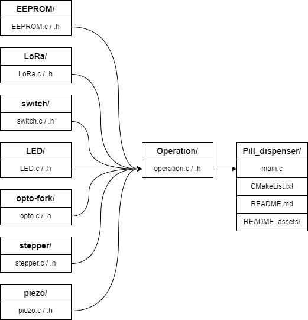

# Pill Dispenser

## **1. Introduction**
The goal of the project is to develop an automated pill dispensing system that delivers medication daily to users at a specific time. The main components and peripherals of this project include a microcontroller board Raspberry Pi Pico, a dispenser base, a dispenser wheel, equipped with eight compartments (seven for pills and one for calibration) which is operated by a stepper motor. A piezoelectric sensor is also integrated, for detecting whether a pill is dropped out from the compartment and an optical sensor (opto-fork) is for wheel positioning and calibration. During the program’s execution, the program's state including a total number of detected pills and dispensing state as well as descriptive log messages are stored in EEPROM I2C, allowing for operations beyond reboots. Additionally, some device status is sent to the server via the LoRaWAN network and also logged to stdout via a Debug Probe. In terms of software, the project utilizes Embedded C programming within the Raspberry Pi Pico SDK framework.

This documentation provides an overview of the program workflow, implementation principles as well as in-depth peripherals features and utilities within the scope of the project. 

### **1.1. Program Workflow**
")
The program starts by initializing essential board pins, calling values from EEPROM which were possibly stored in there during the previous session, connecting to the MQTT-server via the LoRa module, and logging messages in between the initialization.

The program then enters a logically infinite ‘while (true)’ -loop. If dispensing is considered ‘underway’ – retrieved and read from EEPROM – the program recalibrates and starts dispensing without waiting for user input; if dispensing is not considered as ‘underway’, the program prompts and waits for the user to press buttons before proceeding.

‘Dispensing underway’ is derived initially from the ‘compartment index’ value – referring to the last compartment the program had rotated to – read from the EEPROM during initialization. If the value is equal to the last compartment index, the program concludes that dispensing is not underway, while any of the other compartment indices indicate dispensing being underway.

## **2. Utilities**
### **2.1. I2C EEPROM**
The EEPROM chip used in the project is compatible with AT24C256 which has a highest memory address of 32767.
EEPROM will be used to store log messages which records the status of the device including – but not concluding:
- Boot
- Program state: calibration or dispense state
- Button press detection
- Pill drop detection
- Dispenser finished
The program also uses the highest EEPROM addresses to store operation state values, including next available index for a log entry, the number of compartments rotated and number of pills detected thus far, which are utilized for operating beyond reboots.
The log messages follow the logic below:
- Log starts from address 0 in the EEPROM
- The first 2 kilobytes (2048 bytes) of EEPROM are used for the log messages.
- The log continues logging from the location where it left off last time and the log is erased only when it’s full.
- Log contains 32 entries. Each log entry is reserved 64 bytes. 
- Each log entry consists of a string that contains a maximum of 61 characters, a terminating null character (‘\0’) and a two-byte CRC that is used to validate the integrity of data. The shorter entry will not use all reserved bytes.
- When a log entry is written to the log, the string is written to the log including terminating zero, following 16-bit CRC (MSB first followed by LSB).
- If the log is full, the log is erased and it starts writing the log to the first entry with address 0.
- The log messages can be read by pressing a button SW_1.

### **2.2. LoRa (UART)**
LoRa-E5 (Lora Wireless Module) is used to connect to an MQTT-server. After a successful connection, messages can be sent. To achieve this, the LoRa module is first initialized and a command is sent to check a connection. After sending a command, Lora will return results indicating whether the command executed successfully or not. Therefore, a function is created to read the results from LoRa.

- UART configuration 8 bits data, no parity, 1 stop bit, 2 uart pins(0,1) and waiting time to get response from LoRa.  

- Connect network. Before sending messages, Lora needs to connect to the MQTT-server. Following commands connect the module to the MQTT-server, . 
	- Set LWOTAA mode: ```AT+MODE=LWOTAA.``` Return ```+MODE: LWOTAA.```
	- Change application session key:  ```AT+KEY=APPKEY,” device key”. ```Return  ```+KEY: APPKEY device key.```
	- Set class A mode when power on: ```AT+CLASS=A```. Return ```+CLASS A.```
	- Set port number to send message ```AT+PORT=8```. Return ```+PORT:8```. 
	- Command to join a known network ```AT +JOIN```. Return 
	 - ```+JOIN: Starting``` 
	 - ```+JOIN: NORMAL``` 
	 - ```+JOIN: NetID 000024 DevAddr 48:00:00:01```
	 - ```+JOIN: Done.``` 
- Command to send string ```AT+MSG="Data to send"```. Return:
	- ```+MSG: Start``` 
	- ```+MSG: FPENDING```
	- ```+MSG: Link 20, 1``` 
	- ```+MSG: ACK Received``` 
	- ```+MSG: MULTICAST```
	- ```+MSG: PORT: 8; RX: "12345678"```
	- ```+MSG: RXWIN214, RSSI -106, SNR 4```
	- ```+MSG: Done```

- Read response from Lora. 
After sending the command, LoRa will return a string indicating whether the result is correct or incorrect. A function called get_response is to read this string and return its value. 
- Example:
	- One valid ```AT``` Command must end with ```'\n'```, ```"\r\n"``` is also valid;
	- Example: ```"AT+KEY=APPKEY,\"3ffb2c845fe93f3f5a99c91c11844b81\"\r\n"```

### **2.3. Switch**
The program dedicates two switches for:
* proceeding the operation forward
* printing EEPROM logs to stdout with read_log_entry() function
The switches are:
- initialized as structs, holding values for their:
	- gpio pin
	- flag called ‘pressed’, used for debouncing their input
	- ‘board_index’, referring to their on-board “name”
- handled with switch_pressed_debounced() function, which debounces their input, in accordance with the switches’ ‘pressed’ flags

### **2.4. LED**
The program initializes one LED (LED_3) with a PWM counter to allow for a dimmer brightness of 5%. LED brightness is adjusted throughout the program in accordance with the program’s state.

The LED is handled as a struct, holding values for the LED’s pin, slice, channel and current PWM level, allowing to adjust the LED’s light with the PWM setup.

### **2.5. Opto-fork**
The opto-fork is operated with an interrupt handler, initialized for detecting both falling and rising edges, allowing for more intricate control over rotation actions.

### **2.6. Stepper Driver**
The stepper driver is configured to the designated pins: IN1 = 2, IN2 = 3, IN3 = 6, IN4 = 13 as outputs.
The step.c operation is callable both clockwise and counterclockwise according to its boolean parameter, moving in half-steps. The half-steps are predefined in a global static const array as bitmasks.
Likewise the driver pins are given bitmasks, with which the driver pins are driven high depending on the current steps mask.
Step function saves its last taken step as a static value for subsequent calls – though not beyond reboot (calibration takes this into account), in order to continue consistently and smoothly from the previous position.

### **2.7. Piezo sensor**
Pill drop is detected using piezoelectric sensor interruption to detect the falling edge. Piezo sensor is first initialized with a corresponding pin. When dispensing the pills, every time the stepper motor rotates to the next compartment, the program waits for a maximum timeout of 85ms (calculated according to the height from a compartment to the sensor) to detect the falling edge in the piezo sensor, which also means that the pill is dropped from the compartment. If the falling edge is not detected within a specified timeout, it means no pill is detected.
## **3. Implementation**
Operation.c source file includes functions that call multiple “pin sets”, streamlining the “#include“ library through this single file set, avoiding circular dependency between several source files (such as stepper or EEPROM files). For instance, blink_until_switch_pressed() function requires both LED and switch handling, while not belonging to either over the other, thus defined and declared in the operation files.

### **3.1. Logging**
Logging occurs throughout the program in various pertinent places. All log messages are printed to the console (stdout) via Debug Probe and stored to the EEPROM log entries. Since processing LoRa messages bears a delay (approximately 3 seconds) interfering with user experience and some time-sensitive scenarios, only selected messages are sent to the MQTT-server via the LoRa module:
- A successful connection to the MQTT-server.
- Calibration and recalibration finished.
- Commencing and finishing dispensing.
- Whether a pill drop was detected during a dispense.

### **3.2. Interrupt Handling**
Both opto-fork and piezo-sensor events are operated with hardware interrupts. Thus a mutual interrupt handler is defined which then differentiates the events according to the sensors’ gpio pins and event masks.

Opto-fork is initialized for both falling and rising edges, and piezo-sensor for a falling edge, each of the three events having their own flags.

### **3.3. Calibration**
")
Calibration has two different versions:
1.	Full calibration, when dispensing is not underway.
2.	Recalibration, when dispensing is underway.

Both versions calibrate the dispensing-disk by confirming their position using the opto-fork. Both also measure the opto-fork’s area’s width, which is used for aligning the disk with the dispenser's hole.

1.	Full calibration rotates clockwise, first searching for the opto-fork, confirming its position, then continues to rotate for a full revolution, counting the steps it takes to rotate the full revolution in addition to the opto-fork’s area width, finally aligning the disk on top of the dispenser hole, according to the opto-fork’s area width , and resets the number of ‘pills detected’ to 0, storing the value to EEPROM.

2.	Recalibration first rotates counter-clockwise past the opto-fork to the opto-forks edge, then rotates clockwise through the opto-fork to measure it, then counter-clockwise again to align the disk with the dispenser hole, finally clockwise to the compartment it was supposed to be at according to the data read from EEPROM.
This order and directions of rotations takes into account the possibility that it was within the opto-fork area to begin with, all the while avoiding dropping any (potential) pills in its compartments.
The sleep_ms() function is for killing the stepper’s spin momentum, so that it does not slip past its step when rotation direction is changed.

### **3.4. Dispensing**
")
Dispensing starts by storing the current compartment index to EEPROM. The operation loops as long as the compartment index reaches the final one, 7. Within the loop iterations the program waits for a set time interval, referred from the system's internal clock. During this waiting period, the user may press SW_1 to read EEPROM logs. After the time period has elapsed, the piezo detection flag is reset to false – to remove possible false positives – and the disk is rotated equal to ⅛ of a full revolution (= 1 compartment). After having completed a rotation, the new compartment index is logged to EEPROM and piezo’s ‘pill detection’ is checked. If a pill was detected, it is updated to EEPROM; if not, the LED 3 blinks 5 times. After having reached the last compartment, dispensing ‘status’ is set as false and the operation returns back to the main loop.
